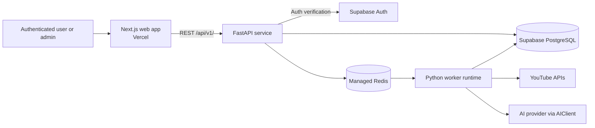
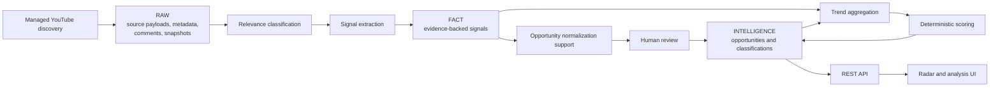

# YouTube AI Business Radar — Architecture Baseline v0.1

Status: Accepted
Version: 0.1
Last updated: 2026-09-04

## 1. Architecture goals

The v0.1 architecture supports the frozen product scope in `docs/product-spec.md` while keeping evidence traceable, scoring reproducible, and operational complexity proportionate to an MVP.

Its goals are to:

- Preserve logical RAW, FACT, and INTELLIGENCE boundaries.
- Separate user-facing, application API, and background-processing responsibilities.
- Make every AI-derived record auditable from source through parsed output.
- Keep LLM extraction separate from deterministic scoring.
- Support human review and individual authenticated users.
- Allow future evidence-source adapters without changing the Opportunity model.
- Favor a coordinated monorepo and independently runnable components over microservices or heavy orchestration.

## 2. System context

The browser uses a Next.js web application deployed on Vercel. The web application calls the FastAPI application API. The API and workers use Supabase-hosted PostgreSQL as the source of truth. FastAPI enqueues background jobs through Redis; Python workers collect YouTube data, perform AI-assisted extraction, and aggregate intelligence.



YouTube is the only automated external evidence source in v0.1. Manually added evidence enters through application-controlled workflows. No public API is offered.

## 3. Runtime components

### Web app — `apps/web`

The Node.js, TypeScript, Next.js, Tailwind CSS, and shadcn/ui application owns the six MVP interfaces, browser-side interaction, presentation, calls to the FastAPI REST API, and role-appropriate route experiences. It does not access PostgreSQL directly or calculate authoritative scores.

### API service — `apps/api`

The Python 3.12+, FastAPI, and Pydantic v2 service owns the versioned REST API, domain application services, persistence access, authentication and authorization enforcement, review workflows, query endpoints, and background-job submission.

### Worker runtime — `workers/*`

The workers are modules of one Python worker runtime, not separate microservices. They may share backend/domain Python packages where ownership remains clear.

- `workers/youtube`: discovery, video and channel metadata collection, public comment collection, and historical snapshots.
- `workers/extraction`: relevance classification, structured signal extraction, normalization support, and AI processing.
- `workers/aggregation`: trend aggregation, scoring-input preparation, and score recomputation.

Workers execute queued jobs through Dramatiq backed by Redis. Separate worker processes or queues may be used operationally without creating independently owned services.

## 4. Repository structure

The repository is a coordinated monorepo with lightweight, independent toolchains. v0.1 does not use Nx, Turborepo, Bazel, Pants, or another monorepo framework.

```text
apps/web/                 Next.js web application
apps/api/                 FastAPI service and Python application/domain code
workers/youtube/          YouTube collection jobs
workers/extraction/       AI extraction and normalization-support jobs
workers/aggregation/      Trend and scoring-recomputation jobs
packages/schemas/         Future neutral, AI-output, or generated contracts
packages/scoring/         Shared deterministic scoring package
prompts/                  Immutable versioned prompt assets
database/migrations/      Database migrations (defined in later tasks)
database/seeds/           Explicit seed assets
tests/                    Cross-component and integration tests
docs/                     Specifications and architecture decisions
```

The web workspace uses Node.js and npm. Commands are run from `apps/web`, for example `npm install`, `npm run dev`, `npm test`, and `npm run build` once scripts exist.

Python projects use Python 3.12+ and uv. Commands are run from the relevant Python project workspace, or from the repository root when a future root Python workspace explicitly supports it, for example `uv sync`, `uv run pytest`, and `uv run <command>`. TASK-003 does not create package manifests or command scripts. Python and TypeScript do not share a package manager.

## 5. Data-flow overview



Discovery and monitoring remain distinct job concerns: discovery searches for unknown opportunities, while monitoring refreshes known videos, channels, and opportunities. Both preserve source timestamps and collection-run context.

## 6. RAW / FACT / INTELLIGENCE boundaries

The three layers are logical boundaries within the same PostgreSQL source of truth. TASK-004 will decide their concrete relational representation; v0.1 does not require separate databases or PostgreSQL schemas.

- **RAW** preserves API/source data, source timestamps, collection context, and payload fidelity. Downstream failures must not corrupt it.
- **FACT** contains structured, atomic signals tied to supporting evidence. Creator claims remain explicitly represented as claims rather than silently promoted to verified facts.
- **INTELLIGENCE** contains normalized opportunities, classifications, trend snapshots, score inputs, reproducible score outputs, confidence, and hype-risk results.

Every transition preserves lineage. Derived records must be traceable to evidence, extraction/run identifiers, and relevant persisted inputs.

## 7. API boundary

FastAPI owns the application API. v0.1 uses REST under the suggested `/api/v1/` namespace and does not introduce GraphQL. The web app communicates with domain behavior through this API rather than direct database access. Detailed resources and endpoint contracts belong in `docs/api-contract.md`.

Pydantic v2 models in the Python application/domain layer are authoritative for backend API schemas. Frontend TypeScript types may initially be maintained separately. A future preferred direction is FastAPI OpenAPI to generated TypeScript client/types, but generation is not part of TASK-003.

`packages/schemas` is reserved for language-neutral JSON Schemas, AI structured-output schemas, or generated/shared contracts when justified. It must not duplicate every Pydantic model or become a general model dumping ground.

## 8. Background processing

v0.1 uses Dramatiq with Redis for queued background work. A lightweight scheduler compatible with Dramatiq submits recurring jobs; the specific scheduler package is a later implementation choice and must not redefine job semantics.

Initial queue responsibilities are YouTube collection, AI extraction, and aggregation. Scheduled job categories include managed-query discovery, video-statistic snapshots, monitoring refreshes, and opportunity aggregation/recomputation.

TASK-019 fixes aggregation as deterministic application code on the `aggregation` queue. A daily
UTC scheduler submits one bounded batch for each supported window; it never invokes an LLM or
calculates the final Opportunity Score.

Jobs must be designed for at-least-once delivery:

- Use stable job inputs and idempotency keys where practical.
- Make persistence operations safe to retry and avoid duplicate logical results.
- Retry transient failures with bounded attempts and backoff.
- Treat validation and permanently invalid inputs as non-retryable.
- Persist job/run status and final failure details.
- Route exhausted or terminal failures to a dead-letter or failed-job path that supports admin/debug inspection and deliberate replay.

Exact queue names, retry counts, backoff intervals, scheduling package, and retention periods remain implementation decisions.

## 9. AI boundary

Domain logic and extraction workflows depend on an application-facing `AIClient` abstraction rather than a provider SDK. Its conceptual capabilities are `classify(...)`, `extract(...)`, and `structured_generate(...)`. An initial adapter may use OpenAI, but provider-specific construction, credentials, retries, and parsing remain behind the adapter.

LLMs extract and classify structured evidence. They do not calculate the authoritative Opportunity Score. Confidence Score and Hype Risk may consume structured AI classifications, but final stored calculations must be reproducible from persisted inputs. Detailed formulas belong in `docs/scoring.md`.

Every extraction must persist or reference the source, task type, model identifier, prompt version, input hash, raw output, parsed output, extraction/run identifier, and processing status.

## 10. Prompt/version management

Prompts are versioned repository assets using `prompts/<task-name>/v001.*`, such as `prompts/relevance-filter/v001.md` and `prompts/signal-extractor/v001.md`.

An extraction record references its task type, prompt version, model identifier, and input hash. Prompt changes create a new numbered version. **An already-used prompt version must never be silently edited.** This is a hard project rule; corrections require a new prompt version so historical runs remain reproducible.

## 11. Authentication model

v0.1 uses Supabase Auth for authenticated individual users and defines two roles:

- `user`: access to radar, opportunities, signals, and the user’s watchlist.
- `admin`: all `user` permissions plus `/admin/review` and administrative review actions.

FastAPI enforces authorization for API operations. Web route guards improve user experience but are not authoritative. v0.1 does not include organizations, teams, invitations, enterprise RBAC, or arbitrary permission systems. Multi-tenancy may be revisited after v0.1.

## 12. Persistence strategy

Supabase-hosted PostgreSQL is the system of record for source data, facts, intelligence, review state, watchlists, collection runs, extraction runs, and reproducibility inputs.

pgvector is used only when semantic similarity is necessary, primarily for retrieving opportunity candidates during normalization. v0.1 does not use a separate vector database. Similarity supplies candidates; it does not replace evidence, deterministic rules, or human review.

Detailed tables, constraints, indexes, retention, and physical layer organization belong to TASK-004 and `docs/database.md`.

## 13. Deployment topology

### Development

Developers use `scripts/dev-runtime.sh` to run the Next.js app, FastAPI service, Dramatiq worker,
and scheduler as one local process group. All Python processes resolve `apps/api/.env` independent
of working directory and print a shared secret-free runtime fingerprint. PostgreSQL/Auth may use a
Supabase development project or supported local setup. Redis runs locally or through an explicitly
configured development service. External calls are mocked in normal automated tests.

### Production

- Web: Next.js deployed to Vercel.
- API: containerized FastAPI service.
- Workers: containerized Python worker process or processes.
- Queue: managed Redis where practical.
- Database and authentication: Supabase.

The API and workers may initially share one VM or container host while running as separate processes or containers. They remain independently restartable and may be scaled separately later. Kubernetes is not required.

## 14. Observability

The minimum v0.1 baseline is structured logs; request correlation IDs where practical; stable background-job IDs; collection-run and extraction/run identifiers; persistent collection and AI-extraction statuses; and failure details visible to authorized admin/debug workflows without exposing secrets.

A large metrics, tracing, or log-aggregation stack is not required. Sentry or a similar service may be evaluated later.

## 15. Testing strategy

Testing follows a pyramid favoring fast deterministic tests.

- **Python:** unit tests, domain/scoring tests, repository/service tests, and FastAPI integration tests.
- **Frontend:** TypeScript checks, targeted component tests, and limited end-to-end tests for critical workflows later.
- **AI pipeline:** structured-output schema validation, deterministic fixtures, and later prompt regression/evaluation datasets.
- **External systems:** mock YouTube, AI-provider, Redis-boundary, and other external API interactions in normal CI.

Live YouTube or AI calls are not required for normal CI.

## 16. Security/configuration

Secrets and environment-specific configuration are supplied through environment variables and never committed. Categories include Supabase, YouTube API, Redis, AI provider, and application environment settings. `.env.example` contains names and non-secret guidance only.

Services validate required configuration at startup and avoid logging credentials, tokens, or raw secrets. API authorization is enforced server-side. Service-role credentials must never be exposed to the browser.

## 17. Extension points

An application-facing `EvidenceSourceAdapter` isolates source discovery and retrieval from the Opportunity model. The YouTube adapter is the only automated adapter in v0.1. Future adapters may produce compatible evidence without redesigning opportunities, but those integrations remain out of scope.

Additional boundaries are the provider-neutral `AIClient`, persistence repository interfaces, and replaceable scheduler submission mechanism. These are focused seams, not a general plugin framework.

## 18. Explicit non-goals for v0.1

- Microservice decomposition of individual worker modules.
- Heavy monorepo frameworks.
- Kafka, Temporal, Celery, or Kubernetes-native job orchestration.
- GraphQL or a public API.
- A separate vector database.
- Automatic cross-language schema generation.
- Kubernetes as a deployment requirement.
- Organizations, teams, invitations, enterprise RBAC, or arbitrary permissions.
- Automated ingestion from sources excluded by `docs/product-spec.md`.
- Billing, notifications, mobile apps, browser extensions, or large-scale unofficial transcript scraping.

## 19. Architecture decisions summary

| Area | v0.1 decision | Record |
| --- | --- | --- |
| Repository/tooling | Coordinated monorepo; npm for web, uv for Python; no monorepo framework | ADR-001 |
| Runtime/jobs | FastAPI plus one modular Python worker runtime; Redis and Dramatiq | ADR-002 |
| Authentication | Supabase Auth with individual `user` and `admin` roles | ADR-003 |
| AI/prompts | Provider-neutral `AIClient`; immutable repository prompt versions | ADR-004 |
| Deployment | Vercel web, containerized API/workers, managed Redis, Supabase | ADR-005 |
| API | REST through FastAPI under `/api/v1/`; no GraphQL | This baseline |
| Persistence | Supabase PostgreSQL source of truth; pgvector only where needed | This baseline |
| Schemas | Pydantic authoritative; neutral/generated contracts only in `packages/schemas` | This baseline |
| Scoring | Structured AI inputs allowed; final stored calculations reproducible and code-owned | This baseline |

## 20. Known future decisions

- Detailed database model, constraints, indexes, and layer representation.
- REST endpoint contracts and error conventions.
- Exact queues, retry limits, scheduler package, dead-letter storage, and retention.
- Python project/package boundaries and concrete command manifests.
- Whether and when to generate TypeScript contracts from FastAPI OpenAPI.
- Initial AI provider/model and provider-specific operational limits.
- Score, Confidence Score, and Hype Risk formulas.
- Prompt evaluation datasets and release gates.
- Production API/worker hosting vendor, network controls, scaling thresholds, and recovery.
- Observability vendor choices and service-level objectives.
