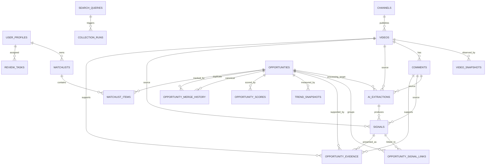

# YouTube AI Business Radar — Database Domain Model v0.1

Status: Frozen for v0.1
Version: 0.1
Last updated: 2026-09-04

## 1. Goals

The database model preserves YouTube source observations, evidence-backed facts, and derived business intelligence in one Supabase-hosted PostgreSQL database. It supports idempotent ingestion, auditable AI extraction, historical trends, reproducible scoring, human review, individual watchlists, and non-destructive opportunity merging.

This document defines the logical relational model. TASK-005 will translate it into SQL migrations without changing these semantics silently.

## 2. Modeling principles

- Use UUID primary keys, generated by the database unless a migration specifies an equivalent safe mechanism.
- Use `TIMESTAMPTZ` for instants and preserve original observation timestamps separately from database creation timestamps.
- Add `updated_at` only to mutable records and update it on material mutation.
- Model stable domain attributes relationally. Use JSONB only for source metadata, semi-structured lists, AI payloads, and reproducibility snapshots.
- Keep ingestion idempotent through external-ID uniqueness and stable run/extraction identities.
- Use `VARCHAR` with `CHECK` constraints for evolving taxonomies and statuses; do not use PostgreSQL ENUM in v0.1.
- Constrain non-negative counts, normalized confidence to `0..1`, scores to `0..100`, ranges, periods, and lifecycle states in PostgreSQL.
- Retain history and provenance. Avoid cascades that erase source, extraction, review, trend, score, or merge records.
- Do not physically split RAW, FACT, and INTELLIGENCE into separate databases. They are logical ownership boundaries.

## 3. RAW / FACT / INTELLIGENCE mapping

| Layer | Tables | Responsibility |
| --- | --- | --- |
| Identity/support | `user_profiles` | Application identity and coarse role mapped to Supabase Auth |
| RAW | `search_queries`, `collection_runs`, `youtube_discovery_items`, `channels`, `videos`, `video_snapshots`, `comments` | Source discovery staging, canonical YouTube records, observations, and collection audit |
| FACT | `ai_extractions`, `signals` | Auditable AI operations and atomic evidence-backed observations |
| INTELLIGENCE | `opportunities`, `opportunity_signal_links`, `opportunity_evidence`, `opportunity_merge_history`, `trend_snapshots`, `opportunity_scores`, `review_tasks`, `watchlists`, `watchlist_items` | Normalization, provenance presentation, time series, scoring, review, and user tracking |

Logical ownership does not prevent foreign keys across layers. Those links are required to preserve lineage.

## 4. Entity overview

- Discovery begins with managed `search_queries` and observable `collection_runs`.
- `youtube_discovery_items` stages bounded `search.list` results without creating incomplete canonical channels or videos.
- `channels` own canonical `videos`; videos own historical `video_snapshots` and public `comments`.
- `ai_extractions` audit model work against a known video, comment, signal, or opportunity source.
- Atomic `signals` refer to source evidence and optionally to the extraction that produced them.
- `opportunities` normalize many signals through `opportunity_signal_links` and expose research provenance through `opportunity_evidence`.
- `opportunity_merge_history` preserves canonical lineage when duplicates are merged.
- `trend_snapshots` retain versioned historical windows; exact identities are deterministic
  materializations. `opportunity_scores` remain append-only intelligence history.
- `review_tasks` retain administrative decisions about signals or opportunities.
- `user_profiles` own `watchlists`, which contain `watchlist_items` referencing opportunities.

`channel_snapshots` is deferred. v0.1 requires video-statistic history, while channel-growth analysis is not yet a frozen product requirement. It may be added later without changing existing entities.

## 5. Mermaid ERD

The `review_tasks` target is a constrained application-level reference described below; Mermaid shows only its relational assignee foreign key.

## 6. Full table definitions

### 6.1 `user_profiles`

**Purpose:** Application profile associated one-to-one with a Supabase Auth identity.
**Layer:** Identity/support.
**Primary key:** `id UUID`.

**Fields**

| Field | Type | Null/default | Meaning |
| --- | --- | --- | --- |
| `id` | UUID | PK, not null | Application profile identity |
| `auth_user_id` | UUID | unique, not null | References the Supabase Auth user identifier |
| `role` | VARCHAR | not null | `user` or `admin` |
| `created_at` | TIMESTAMPTZ | not null | Creation time |
| `updated_at` | TIMESTAMPTZ | not null | Last profile change |

**Foreign keys:** `auth_user_id` conceptually references `auth.users(id)` in the Supabase-managed auth schema; TASK-005 must use the supported cross-schema FK form.
**Uniqueness:** `auth_user_id`.
**Important indexes:** Unique index on `auth_user_id`; optional role index only if admin lookup warrants it.
**Important constraints:** `role IN ('user', 'admin')`; required timestamps.
**Lifecycle notes:** Created after or with the Auth user. Deleting an Auth identity must not silently cascade through historical review decisions; account-deletion handling must first resolve owned data.

### 6.2 `search_queries`

**Purpose:** Managed YouTube discovery or monitoring queries.
**Layer:** RAW.
**Primary key:** `id UUID`.

**Fields:** `id UUID` PK; `query TEXT NOT NULL`; `query_group VARCHAR NOT NULL`; `language VARCHAR NULL`; `region VARCHAR NULL`; `enabled BOOLEAN NOT NULL DEFAULT TRUE`; `priority NUMERIC NOT NULL`; `discovery_mode VARCHAR NOT NULL`; `last_run_at TIMESTAMPTZ NULL`; `created_at TIMESTAMPTZ NOT NULL`; `updated_at TIMESTAMPTZ NOT NULL`.

**Foreign keys:** None.
**Uniqueness:** A normalized definition key over `lower(query)`, `query_group`, `coalesce(language, '')`, `coalesce(region, '')`, and `discovery_mode` prevents duplicate definitions, including disabled rows. Re-enable or update the existing definition instead of creating an active duplicate.
**Important indexes:** `enabled, priority`; `last_run_at`; the unique definition expression.
**Important constraints:** `discovery_mode IN ('discovery', 'monitoring')`; non-empty trimmed query and query group; `priority >= 0`; required timestamps. `query_group` is an evolving CHECK-constrained taxonomy initially allowing `technology`, `business`, `revenue`, `pain`, `industry`, and `discovery`.
**Lifecycle notes:** Mutable configuration. `last_run_at` is a convenience cursor, while `collection_runs` remains the audit history.

### 6.3 `collection_runs`

**Purpose:** Observable execution record for source collection.
**Layer:** RAW.
**Primary key:** `id UUID`.

**Fields:** `id UUID` PK; `source_type VARCHAR NOT NULL`; `run_type VARCHAR NOT NULL`; `status VARCHAR NOT NULL`; `started_at TIMESTAMPTZ NULL`; `finished_at TIMESTAMPTZ NULL`; `search_query_id UUID NULL`; `items_discovered INT NOT NULL DEFAULT 0`; `items_processed INT NOT NULL DEFAULT 0`; `items_failed INT NOT NULL DEFAULT 0`; `error_summary TEXT NULL`; `metadata JSONB NULL`; `created_at TIMESTAMPTZ NOT NULL`.

**Foreign keys:** `search_query_id -> search_queries.id ON DELETE RESTRICT`.
**Uniqueness:** No natural uniqueness is imposed because deliberate reruns are retained; scheduler/job idempotency must reuse or resolve a stable run identity at the service boundary.
**Important indexes:** `status, created_at`; `run_type, created_at`; `search_query_id, created_at`.
**Important constraints:** `source_type = 'youtube'`; `run_type IN ('discovery', 'metadata_collection', 'channel_monitor', 'video_snapshot', 'comment_collection')`; `status IN ('pending', 'running', 'completed', 'partial', 'failed', 'cancelled')`; counts are non-negative; `finished_at >= started_at` when both exist. Pending runs have neither execution timestamp; running runs require `started_at` and no `finished_at`; terminal states require both.
**Lifecycle notes:** Status transitions are `pending -> running -> completed|partial|failed|cancelled`; cancellation before start may use `pending -> cancelled` with `finished_at` and no `started_at`. Retain runs for operations and audit.

### 6.4 `channels`

**Purpose:** Canonical YouTube channel records.
**Layer:** RAW.
**Primary key:** `id UUID`.

**Fields:** `id UUID` PK; `youtube_channel_id VARCHAR NOT NULL`; `name TEXT NOT NULL`; `description TEXT NULL`; `country VARCHAR NULL`; `subscriber_count BIGINT NULL`; `video_count BIGINT NULL`; `view_count BIGINT NULL`; `channel_type VARCHAR NULL`; `first_seen_at TIMESTAMPTZ NOT NULL`; `last_seen_at TIMESTAMPTZ NOT NULL`; `created_at TIMESTAMPTZ NOT NULL`; `updated_at TIMESTAMPTZ NOT NULL`.

**Foreign keys:** None.
**Uniqueness:** `youtube_channel_id`.
**Important indexes:** Unique index on `youtube_channel_id`; `last_seen_at`; optional `channel_type` for filtering.
**Important constraints:** Counts are null or non-negative; `last_seen_at >= first_seen_at`; `channel_type` is nullable and, when present, one of `founder`, `business_media`, `ai_educator`, `vc`, `consultant`, `vendor`, `news`, `unknown`.
**Lifecycle notes:** Upsert by YouTube ID. Classification is optional. Current metrics are mutable convenience values; channel history is not captured in v0.1.

### 6.5 `videos`

**Purpose:** Canonical discovered YouTube videos.
**Layer:** RAW.
**Primary key:** `id UUID`.

**Fields:** `id UUID` PK; `youtube_video_id VARCHAR NOT NULL`; `channel_id UUID NOT NULL`; `title TEXT NOT NULL`; `description TEXT NULL`; `published_at TIMESTAMPTZ NOT NULL`; `duration_seconds INT NULL`; `language VARCHAR NULL`; `category_id VARCHAR NULL`; `thumbnail_url TEXT NULL`; `current_view_count BIGINT NULL`; `current_like_count BIGINT NULL`; `current_comment_count BIGINT NULL`; `has_captions BOOLEAN NULL`; `first_seen_at TIMESTAMPTZ NOT NULL`; `last_seen_at TIMESTAMPTZ NOT NULL`; `processing_status VARCHAR NOT NULL`; `created_at TIMESTAMPTZ NOT NULL`; `updated_at TIMESTAMPTZ NOT NULL`.

**Foreign keys:** `channel_id -> channels.id ON DELETE RESTRICT`.
**Uniqueness:** `youtube_video_id`.
**Important indexes:** Unique `youtube_video_id`; `channel_id`; `published_at`; `processing_status`; optionally `(processing_status, published_at)`.
**Important constraints:** Duration and counts are null or non-negative; `last_seen_at >= first_seen_at`; `processing_status IN ('new', 'queued', 'processing', 'processed', 'review', 'ignored', 'failed')`; required source timestamps.
**Lifecycle notes:** Upsert source metadata by YouTube ID. Current counts are convenience values backed by append-only snapshots. AI-derived industry, business model, pain, or opportunity scores never belong here.

### 6.6 `video_snapshots`

**Purpose:** Historical video statistics for interval-based velocity analysis.
**Layer:** RAW.
**Primary key:** `id UUID`.

**Fields:** `id UUID` PK; `video_id UUID NOT NULL`; `captured_at TIMESTAMPTZ NOT NULL`; `view_count BIGINT NULL`; `like_count BIGINT NULL`; `comment_count BIGINT NULL`; `created_at TIMESTAMPTZ NOT NULL`.

**Foreign keys:** `video_id -> videos.id ON DELETE RESTRICT`.
**Uniqueness:** `(video_id, captured_at)`.
**Important indexes:** Unique `(video_id, captured_at DESC)`.
**Important constraints:** Counts are null or non-negative.
**Lifecycle notes:** Append-only. Do not store fixed 24-hour deltas; derive velocity for the requested interval from observations. Corrections append a corrected observation with a distinct capture time rather than mutate history.

### 6.7 `comments`

**Purpose:** Public YouTube comments retained as customer-discovery evidence.
**Layer:** RAW.
**Primary key:** `id UUID`.

**Fields:** `id UUID` PK; `youtube_comment_id VARCHAR NOT NULL`; `video_id UUID NOT NULL`; `text TEXT NOT NULL`; `published_at TIMESTAMPTZ NOT NULL`; `source_updated_at TIMESTAMPTZ NULL`; `like_count INT NULL`; `reply_count INT NULL`; `author_hash VARCHAR NULL`; `is_question BOOLEAN NULL`; `language VARCHAR NULL`; `first_seen_at TIMESTAMPTZ NOT NULL`; `created_at TIMESTAMPTZ NOT NULL`; `updated_at TIMESTAMPTZ NOT NULL`.

**Foreign keys:** `video_id -> videos.id ON DELETE RESTRICT`.
**Uniqueness:** `youtube_comment_id`.
**Important indexes:** Unique `youtube_comment_id`; `video_id`; `published_at`; optionally `(video_id, published_at)`.
**Important constraints:** Counts are null or non-negative; non-empty text; required observation timestamps.
**Lifecycle notes:** Upsert mutable public metrics/text by YouTube comment ID while preserving `first_seen_at`. `source_updated_at` records YouTube's source edit time separately from application-managed `updated_at`. Identifiable author names are not required; an optional non-reversible `author_hash` may support deduplication/analysis. Retain comments used by evidence or extraction for audit; later privacy or source-removal policy may redact text while preserving lineage metadata.

### 6.8 `ai_extractions`

**Purpose:** Audit every AI processing attempt, including deliberate reruns.
**Layer:** FACT.
**Primary key:** `id UUID`.

**Fields:** All required fields are `id UUID` PK; `source_type VARCHAR NOT NULL`; `source_id UUID NOT NULL`; `task_type VARCHAR NOT NULL`; `provider VARCHAR NOT NULL`; `model VARCHAR NOT NULL`; `prompt_version VARCHAR NOT NULL`; `input_hash VARCHAR NOT NULL`; `status VARCHAR NOT NULL`; `raw_output JSONB NULL`; `parsed_output JSONB NULL`; `confidence NUMERIC NULL`; `error_message TEXT NULL`; `started_at TIMESTAMPTZ NULL`; `completed_at TIMESTAMPTZ NULL`; `created_at TIMESTAMPTZ NOT NULL`. Integrity-supporting fields are `video_id UUID NULL`, `comment_id UUID NULL`, `signal_id UUID NULL`, `opportunity_id UUID NULL`, `attempt_number INT NOT NULL DEFAULT 1`, `supersedes_extraction_id UUID NULL`, nullable non-negative `input_tokens`, `output_tokens`, and `total_tokens`, plus nullable `provider_request_id`.

**Foreign keys:** `video_id -> videos.id ON DELETE RESTRICT`; `comment_id -> comments.id ON DELETE RESTRICT`; `signal_id -> signals.id ON DELETE RESTRICT` (added by migration 0009); `opportunity_id -> opportunities.id ON DELETE RESTRICT`; `supersedes_extraction_id -> ai_extractions.id ON DELETE RESTRICT`.
**Uniqueness:** `(source_type, source_id, task_type, prompt_version, model, input_hash, attempt_number)`. The base six-field identity identifies equivalent work; a deliberate rerun increments `attempt_number` and references the prior attempt when it supersedes it. Enqueue logic should reuse an existing pending/running/completed equivalent attempt unless an explicit rerun is requested.
**Important indexes:** Base six-field identity; `status, created_at`; `task_type, created_at`; `video_id`; `comment_id`; `signal_id`; `opportunity_id`.
**Important constraints:** `source_type IN ('video', 'comment', 'signal', 'opportunity')`; exactly one source FK is non-null and equals `source_id` according to `source_type`; `task_type` initially allows `relevance_filter`, `signal_extractor`, `comment_pain_miner`, `opportunity_normalizer`, `hype_detector`; `status IN ('pending', 'running', 'completed', 'failed', 'invalid_output')`; normalized confidence is null or `0..1`; `attempt_number >= 1`; completed/invalid-output attempts require `completed_at`; completed attempts require parsed output; `completed_at >= started_at`.
**Lifecycle notes:** Retained audit record, not overwritten by a rerun. Raw and parsed outputs are JSONB because provider responses and task schemas vary, but downstream facts are relational. Prompt versions already used are immutable.

### 6.9 `signals`

**Purpose:** Atomic, evidence-backed commercial observations rather than video summaries.
**Layer:** FACT.
**Primary key:** `id UUID`.

**Fields:** Required fields are `id UUID` PK; `source_type VARCHAR NOT NULL`; `source_id UUID NOT NULL`; `ai_extraction_id UUID NULL`; `signal_type VARCHAR NOT NULL`; `statement TEXT NOT NULL`; `evidence_text TEXT NULL`; `normalized_statement TEXT NULL`; `industry VARCHAR NULL`; `sub_industry VARCHAR NULL`; `customer_type VARCHAR NULL`; `problem TEXT NULL`; `solution TEXT NULL`; `business_model VARCHAR NULL`; `price_min NUMERIC NULL`; `price_max NUMERIC NULL`; `price_currency VARCHAR NULL`; `price_period VARCHAR NULL`; `revenue_claim_amount NUMERIC NULL`; `revenue_claim_currency VARCHAR NULL`; `revenue_claim_period VARCHAR NULL`; `customer_count_claim INT NULL`; `technology JSONB NULL`; `distribution_channels JSONB NULL`; `geography JSONB NULL`; `claim_status VARCHAR NOT NULL`; `confidence NUMERIC NOT NULL`; `evidence_strength NUMERIC NULL`; `observed_at TIMESTAMPTZ NULL`; `status VARCHAR NOT NULL`; `created_at TIMESTAMPTZ NOT NULL`; `updated_at TIMESTAMPTZ NOT NULL`. Integrity-supporting fields are `video_id UUID NULL` and `comment_id UUID NULL`.

**Foreign keys:** `ai_extraction_id -> ai_extractions.id ON DELETE RESTRICT`; `video_id -> videos.id ON DELETE RESTRICT`; `comment_id -> comments.id ON DELETE RESTRICT`.
**Uniqueness:** No global statement uniqueness. AI-created signals should be idempotent within an extraction using an implementation-defined stable ordinal or fingerprint introduced in TASK-005 if needed; manual/reviewed observations remain distinct.
**Important indexes:** `signal_type`; `status`; `observed_at`; `video_id`; `comment_id`; `ai_extraction_id`; optional composites `(status, observed_at DESC)` and `(signal_type, status)`.
**Important constraints:** `source_type IN ('video', 'comment')`; exactly one explicit source FK is non-null and equals `source_id`; `signal_type` uses the 16-value taxonomy frozen in `docs/product-spec.md`; `claim_status IN ('fact', 'creator_claim', 'inferred', 'opinion', 'speculation', 'unknown')`; `status IN ('active', 'review', 'ignored', 'rejected')`; confidence and evidence strength are within `0..1`; monetary amounts and customer count are non-negative; `price_min <= price_max` when both exist; currency is required when a price/revenue amount exists; non-empty statement and nonblank evidence text when present.
**Lifecycle notes:** Status changes instead of deletion. One row represents one commercial observation. Review may correct structured fields while provenance, claim classification, and original source remain intact.

### 6.10 `opportunities`

**Purpose:** Canonical normalized commercial opportunities.
**Layer:** INTELLIGENCE.
**Primary key:** `id UUID`.

**Fields:** `id UUID` PK; `slug VARCHAR NOT NULL`; `name TEXT NOT NULL`; `one_line_thesis TEXT NULL`; `industry VARCHAR NULL`; `sub_industry VARCHAR NULL`; `customer_type VARCHAR NULL`; `problem TEXT NULL`; `solution TEXT NULL`; `business_model VARCHAR NULL`; `primary_technology VARCHAR NULL`; `typical_price_min NUMERIC NULL`; `typical_price_max NUMERIC NULL`; `typical_price_currency VARCHAR NULL`; `typical_price_period VARCHAR NULL`; `market_stage VARCHAR NOT NULL`; `competition_level VARCHAR NULL`; `build_difficulty VARCHAR NULL`; `sales_difficulty VARCHAR NULL`; `status VARCHAR NOT NULL`; `first_detected_at TIMESTAMPTZ NOT NULL`; `last_activity_at TIMESTAMPTZ NOT NULL`; `created_at TIMESTAMPTZ NOT NULL`; `updated_at TIMESTAMPTZ NOT NULL`.

**Foreign keys:** None directly; merge history and link tables reference it.
**Uniqueness:** `slug`. Names are not globally unique because legitimate naming overlap may occur.
**Important indexes:** Unique `slug`; `market_stage`; `status`; `industry`; `last_activity_at`; composites supporting radar filters such as `(status, market_stage, last_activity_at DESC)`.
**Important constraints:** `market_stage IN ('unknown', 'emerging', 'accelerating', 'validated', 'crowded', 'mature', 'declining')`; `status IN ('candidate', 'active', 'review', 'merged', 'rejected', 'archived')`; price values non-negative and ordered; currency required with price; `last_activity_at >= first_detected_at`; non-empty slug/name. Competition, build, and sales taxonomies remain CHECK-constrained once TASK-005 confirms their allowed values rather than accepting arbitrary strings.
**Lifecycle notes:** Structured relational record, never one opaque blob. Rejection/archive/merge use states rather than deletion. Current scores are queried from score history and are not duplicated here.

### 6.11 `opportunity_signal_links`

**Purpose:** Structured many-to-many relationship between normalized opportunities and FACT signals.
**Layer:** INTELLIGENCE.
**Primary key:** `id UUID`.

**Fields:** `id UUID` PK; `opportunity_id UUID NOT NULL`; `signal_id UUID NOT NULL`; `relationship_type VARCHAR NOT NULL`; `confidence NUMERIC NULL`; `created_at TIMESTAMPTZ NOT NULL`.

**Foreign keys:** `opportunity_id -> opportunities.id ON DELETE RESTRICT`; `signal_id -> signals.id ON DELETE RESTRICT`.
**Uniqueness:** `(opportunity_id, signal_id)`.
**Important indexes:** `opportunity_id`; `signal_id`; optional `(opportunity_id, relationship_type)`.
**Important constraints:** `relationship_type IN ('supporting', 'contradicting', 'context', 'candidate_match')`; confidence null or `0..1`.
**Lifecycle notes:** Links can be reassigned transactionally during a merge, with merge history retaining the reason and source opportunity. Contradicting evidence is retained rather than discarded.

### 6.12 `opportunity_evidence`

**Purpose:** Presentation/research provenance attached to an opportunity, including evidence not normalized as a signal.
**Layer:** INTELLIGENCE.
**Primary key:** `id UUID`.

**Fields:** `id UUID` PK; `opportunity_id UUID NOT NULL`; `source_type VARCHAR NOT NULL`; `source_external_id VARCHAR NULL`; `signal_id UUID NULL`; `video_id UUID NULL`; `comment_id UUID NULL`; `evidence_type VARCHAR NOT NULL`; `summary TEXT NOT NULL`; `source_url TEXT NULL`; `strength NUMERIC NULL`; `confidence NUMERIC NULL`; `observed_at TIMESTAMPTZ NULL`; `created_at TIMESTAMPTZ NOT NULL`.

**Foreign keys:** `opportunity_id -> opportunities.id ON DELETE RESTRICT`; `signal_id -> signals.id ON DELETE RESTRICT`; `video_id -> videos.id ON DELETE RESTRICT`; `comment_id -> comments.id ON DELETE RESTRICT`.
**Uniqueness:** No blanket uniqueness because one source may support distinct evidence claims. TASK-005 may add a stable evidence fingerprint if ingestion requires idempotent repeated creation.
**Important indexes:** `opportunity_id`; each nullable FK; `source_type, source_external_id`; `observed_at`.
**Important constraints:** `source_type IN ('youtube_video', 'youtube_comment', 'manual')`; video sources require `video_id`, comment sources require `comment_id`, and manual sources require neither; a supplied `signal_id` must be consistent with the cited source at the application/service boundary; strength/confidence null or `0..1`; non-empty summary; evidence type is a documented evolving CHECK taxonomy initially including `pain`, `demand`, `pricing`, `revenue`, `competition`, `adoption`, `distribution`, `growth`, `market_context`.
**Lifecycle notes:** Unlike `opportunity_signal_links`, which relates an opportunity to a normalized FACT, this table is the research/presentation provenance layer and may cite a signal, raw video/comment, or manual evidence directly. Retain cited evidence for audit.

### 6.13 `trend_snapshots`

**Purpose:** Unambiguous time-window aggregates for an opportunity.
**Layer:** INTELLIGENCE.
**Primary key:** `id UUID`.

**Fields:** Required fields are `id UUID` PK; `opportunity_id UUID NOT NULL`; `period_start TIMESTAMPTZ NOT NULL`; `period_end TIMESTAMPTZ NOT NULL`; `aggregation_version VARCHAR NOT NULL`; `video_count INT NOT NULL DEFAULT 0`; `new_video_count INT NOT NULL DEFAULT 0`; `unique_channel_count INT NOT NULL DEFAULT 0`; `total_views BIGINT NOT NULL DEFAULT 0`; `comment_count INT NOT NULL DEFAULT 0`; `pain_signal_count INT NOT NULL DEFAULT 0`; `demand_signal_count INT NOT NULL DEFAULT 0`; `purchase_intent_signal_count INT NOT NULL DEFAULT 0`; `revenue_signal_count INT NOT NULL DEFAULT 0`; `competitor_signal_count INT NOT NULL DEFAULT 0`; `momentum_score NUMERIC NULL`; `created_at TIMESTAMPTZ NOT NULL`. The required window disambiguator is `window_type VARCHAR NOT NULL`.

**Foreign keys:** `opportunity_id -> opportunities.id ON DELETE RESTRICT`.
**Uniqueness:** `(opportunity_id, window_type, period_start, period_end, aggregation_version)`. Formula versions never reinterpret prior-version rows.
**Important indexes:** Versioned unique identity plus retrieval on `(opportunity_id, window_type, period_end DESC)`.
**Important constraints:** `window_type IN ('7d', '30d', '90d')`; `period_start < period_end`; all counts non-negative; momentum score null or `0..100`.
**Lifecycle notes:** Historical windows and formula versions are retained. Within one exact versioned identity the row is a deterministic materialization: normal retries reuse it, while explicit `force=true` recomputes its metric columns in place to incorporate late-arriving linked evidence. Formula changes require a new aggregation version and never update an older version.

### 6.14 `opportunity_scores`

**Purpose:** Persist reproducible score calculations and their components.
**Layer:** INTELLIGENCE.
**Primary key:** `id UUID`.

**Fields:** `id UUID` PK; `opportunity_id UUID NOT NULL`; `calculated_at TIMESTAMPTZ NOT NULL`; `scoring_version VARCHAR NOT NULL`; `input_hash VARCHAR NOT NULL`; `trend_velocity_score NUMERIC NOT NULL`; `demand_evidence_score NUMERIC NOT NULL`; `revenue_evidence_score NUMERIC NOT NULL`; `pain_severity_score NUMERIC NOT NULL`; `competition_white_space_score NUMERIC NOT NULL`; `build_feasibility_score NUMERIC NOT NULL`; `distribution_ease_score NUMERIC NOT NULL`; `opportunity_score NUMERIC NOT NULL`; `confidence_score NUMERIC NULL`; `hype_risk_score NUMERIC NULL`; `inputs_snapshot JSONB NOT NULL`; `created_at TIMESTAMPTZ NOT NULL`.

**Foreign keys:** `opportunity_id -> opportunities.id ON DELETE RESTRICT`.
**Uniqueness:** `(opportunity_id, scoring_version, calculated_at)`.
**Important indexes:** `(opportunity_id, calculated_at DESC)` and unique `(opportunity_id, scoring_version, input_hash)`.
**Important constraints:** All component and final score values are `0..100`; `inputs_snapshot` is a JSON object and records every persisted input/version needed for reproduction; non-empty scoring version.
**Lifecycle notes:** Append-only. Exact input identity is reused; changed evidence or evaluation time inserts a new row. The current score is the latest applicable row by `calculated_at`, not a duplicate cached value on `opportunities`.

Migration 0011 backfills any pre-existing score row with a unique `legacy-<row UUID>` identity because
older rows were not created from a canonical input hash. New `score-v001` rows always use SHA-256.

### 6.15 `review_tasks`

**Purpose:** Durable human-review queue and decision audit.
**Layer:** INTELLIGENCE.
**Primary key:** `id UUID`.

**Fields:** `id UUID` PK; `review_type VARCHAR NOT NULL`; `target_type VARCHAR NOT NULL`; `target_id UUID NOT NULL`; `status VARCHAR NOT NULL`; `priority NUMERIC NOT NULL`; `assigned_to UUID NULL`; `decision VARCHAR NULL`; `decision_notes TEXT NULL`; `created_at TIMESTAMPTZ NOT NULL`; `updated_at TIMESTAMPTZ NOT NULL`; `resolved_at TIMESTAMPTZ NULL`.

**Foreign keys:** `assigned_to -> user_profiles.id ON DELETE SET NULL`. `target_id` is not a database FK because it may identify a signal or opportunity.
**Uniqueness:** A partial uniqueness rule should prevent more than one open task for the same `(review_type, target_type, target_id)` while allowing retained resolved history.
**Important indexes:** `(status, priority DESC, created_at)`; `(target_type, target_id)`; `assigned_to, status`.
**Important constraints:** `review_type IN ('signal_validation', 'opportunity_match', 'opportunity_merge', 'opportunity_creation', 'hype_review', 'quality_review')`; `target_type IN ('signal', 'opportunity')`; `status IN ('pending', 'in_review', 'resolved', 'ignored')`; decision null or one of `approve`, `merge`, `create_new`, `reject`, `ignore`, `defer`; `priority >= 0`; resolved/ignored tasks require `resolved_at` and a decision; open tasks have no resolved timestamp.
**Lifecycle notes:** Retain decisions. The generic target trades database FK enforcement for one review queue across two known target tables. A service-layer target resolver plus transactional existence validation is accepted for v0.1; adding multiple nullable target FKs would complicate each future review target. This exception is narrower than source provenance and allows only documented target types.

### 6.16 `watchlists`

**Purpose:** User-owned opportunity collections.
**Layer:** INTELLIGENCE.
**Primary key:** `id UUID`.

**Fields:** `id UUID` PK; `user_profile_id UUID NOT NULL`; `name TEXT NOT NULL`; `created_at TIMESTAMPTZ NOT NULL`; `updated_at TIMESTAMPTZ NOT NULL`.

**Foreign keys:** `user_profile_id -> user_profiles.id ON DELETE RESTRICT`.
**Uniqueness:** `(user_profile_id, lower(name))`. This supports multiple private watchlists while allowing one conventional default list.
**Important indexes:** `user_profile_id`.
**Important constraints:** Non-empty trimmed name.
**Lifecycle notes:** Never shared between users or teams. Account-deletion workflow may explicitly delete empty/user-owned watchlists only after handling their items and retained audit dependencies.

### 6.17 `watchlist_items`

**Purpose:** Track opportunities selected by a user through a watchlist.
**Layer:** INTELLIGENCE.
**Primary key:** `id UUID`.

**Fields:** `id UUID` PK; `watchlist_id UUID NOT NULL`; `opportunity_id UUID NOT NULL`; `added_at TIMESTAMPTZ NOT NULL`.

**Foreign keys:** `watchlist_id -> watchlists.id ON DELETE CASCADE`; `opportunity_id -> opportunities.id ON DELETE RESTRICT`. The cascade is intentionally limited to user-owned membership rows, not intelligence.
**Uniqueness:** `(watchlist_id, opportunity_id)`.
**Important indexes:** `watchlist_id`; `opportunity_id`.
**Important constraints:** Required timestamp.
**Lifecycle notes:** May be hard-deleted when the user removes an item. If an opportunity is merged, membership is transactionally moved to the canonical opportunity with uniqueness conflict handling.

### 6.18 `opportunity_merge_history`

**Purpose:** Preserve non-destructive lineage for duplicate-opportunity merges.
**Layer:** INTELLIGENCE.
**Primary key:** `id UUID`.

**Fields:** `id UUID` PK; `source_opportunity_id UUID NOT NULL`; `canonical_opportunity_id UUID NOT NULL`; `merged_at TIMESTAMPTZ NOT NULL`; `merged_by UUID NULL`; `reason TEXT NULL`; `created_at TIMESTAMPTZ NOT NULL`.

**Foreign keys:** Both opportunity IDs reference `opportunities.id ON DELETE RESTRICT`; `merged_by -> user_profiles.id ON DELETE SET NULL`.
**Uniqueness:** No uniqueness constraint is required on `source_opportunity_id`; retained history may record a later canonical redirection while service logic resolves the final canonical target.
**Important indexes:** `source_opportunity_id`; `canonical_opportunity_id`; `merged_at`.
**Important constraints:** Source and canonical IDs differ; the source opportunity must have `status = 'merged'` and the canonical must not be merged/rejected/archived, enforced transactionally because cross-row status checks require service logic or a trigger. Merge chains must be resolved to the final canonical record and cycles are forbidden.
**Lifecycle notes:** Append-only. This table is justified because `opportunities.status` alone cannot identify the canonical survivor, reviewer, decision, or merge history.

### 6.19 `youtube_discovery_items`

Internal RAW staging links each accepted search result to its discovery `collection_run` and managed `search_query`. It retains external IDs and optional search snippets, which are non-authoritative hints. `(collection_run_id, youtube_video_id)` is unique, so duplicates within a run are ignored while the same video may appear in later runs. `processing_status` is `pending`, `processing`, `processed`, or `failed`; active claims record `claimed_at`, terminal rows record `processed_at`, successful rows link `canonical_video_id`, and failed rows store a safe `error_summary`. Metadata collectors claim pending rows atomically; maintenance may reset only expired processing claims. RLS is enabled with no authenticated-user policy.

## 7. Relationship rules

- Channel `1 -> many` Video through `videos.channel_id`.
- Video `1 -> many` VideoSnapshot through `video_snapshots.video_id`.
- Video `1 -> many` Comment through `comments.video_id`.
- A known Source `1 -> many` AIExtraction through discriminator-matched explicit source FKs.
- A known Source `1 -> many` Signal through discriminator-matched explicit source FKs.
- Signal `many <-> many` Opportunity through `opportunity_signal_links`.
- Opportunity `1 -> many` TrendSnapshot, OpportunityScore, OpportunityEvidence, and WatchlistItem.
- UserProfile `1 -> many` Watchlist and assigned ReviewTask.
- Watchlist `1 -> many` WatchlistItem.
- Opportunity participates in merge history as canonical or duplicate.

Foreign keys generally use `ON DELETE RESTRICT`. The deliberate exceptions are `review_tasks.assigned_to` and merge actor references using `SET NULL`, and `watchlist_items.watchlist_id` using `CASCADE` because membership is user-owned and disposable.

## 8. Source/evidence provenance model

v0.1 AI extraction targets are videos, comments, signals, or opportunities; signals themselves originate only from videos or comments. `ai_extractions` and `signals` retain the required `source_type` and `source_id`, with explicit nullable foreign keys for their allowed source universe. A CHECK constraint requires exactly one FK and requires it to match the discriminator and `source_id`. Migration 0009 adds the reverse signal extraction reference required for auditable opportunity normalization. This hybrid keeps a stable source identity for application interfaces while providing database-enforced referential integrity for known sources.

Migration 0009 also adds nullable `review_tasks.context JSONB`. It stores bounded normalization
decision context (reason, proposed candidate, candidate IDs, and extraction ID) so a signal-targeted
review is actionable without weakening the constrained polymorphic target model.

`signals.ai_extraction_id` links AI-created facts to the exact provider, model, prompt, input hash, raw output, parsed output, and attempt. Manual/reviewer-created signals may leave it null but still require a concrete video or comment source in v0.1.

`opportunity_signal_links` means “this normalized FACT relates to this opportunity.” `opportunity_evidence` means “this cited research/presentation item supports the opportunity” and can cite a signal, raw video/comment, or manual evidence without forcing every presentation item to be a normalized signal.

Future source types require a deliberate migration: add the adapter’s source table, explicit FK, discriminator value, and integrity constraint. Arbitrary undocumented source values are forbidden.

## 9. Opportunity merge lifecycle

1. An admin resolves a merge review task and selects a canonical opportunity.
2. In one transaction, lock both opportunity rows and reject self-merges, cycles, or an invalid canonical state.
3. Insert `opportunity_merge_history` with source, canonical target, merge time, actor, and reason.
4. Move or recreate signal links, evidence links, and watchlist memberships against the canonical record, resolving uniqueness conflicts without losing provenance.
5. Recompute affected trends/scores rather than moving historical snapshot or score rows. Historical rows remain attached to the opportunity that existed when calculated.
6. Mark the duplicate `status = 'merged'`; keep it queryable and resolve normal reads to the final canonical opportunity.

No source record, signal, evidence item, extraction, prior score, or prior trend snapshot is deleted by a merge.

## 10. Review lifecycle

Review tasks transition from `pending` to `in_review`, then to `resolved` or `ignored`; a pending task may also be ignored. `defer` returns or leaves work in a pending state and records the decision context without marking it finally resolved; TASK-005 must express this consistently in constraints or service transitions.

Assignment is optional. Only admins may mutate review tasks or execute review decisions. Resolved/ignored tasks retain assignee identity when available, decision, notes, and resolution time. The application validates the constrained generic target within the same transaction used to create or act on a review task.

## 11. Snapshot/time-series strategy

- Video snapshots are append-only observations unique by video and capture time.
- Trend snapshots retain historical windows and formula versions; an exact versioned identity is a recomputable derived materialization.
- Supported windows are 7D, 30D, and 90D. `period_end` is exclusive; `period_start = period_end - window`; all boundaries use UTC. Omitted ends round down to the UTC hour.
- Current source counters on videos/channels are mutable conveniences; historical analysis uses snapshots.
- Fixed interval deltas are derived rather than stored on video snapshots.
- Normal calls reuse an exact snapshot. Only explicit force may update one versioned materialization; formula changes create a new version.

## 12. Score persistence strategy

Each calculation creates an append-only `opportunity_scores` row containing component scores, final Opportunity Score, optional Confidence/Hype Risk scores, scoring version, timestamp, and a complete JSONB input snapshot. JSONB is appropriate here because the exact versioned calculation input bundle can evolve while the primary outputs remain relational.

The current score is queried as the latest applicable history row. It is not cached on `opportunities` in v0.1. LLMs may produce structured inputs, but deterministic code owns stored calculations, which must be reproducible from `inputs_snapshot` and `scoring_version`.

## 13. Constraints

TASK-005 must implement, at minimum:

- CHECK-constrained allowed values for every status, role, stage, type, mode, and documented taxonomy.
- Non-negative source counts, durations, priorities, money amounts, and claimed customer counts.
- Normalized confidence/evidence strength in `0..1`.
- Momentum and score components/results in `0..100`.
- `price_min <= price_max` and `typical_price_min <= typical_price_max` when both exist.
- Currency presence when a related monetary amount exists.
- `period_start < period_end`, and end/completion timestamps not before starts.
- Required creation and source-observation timestamps.
- Source discriminator/FK consistency and exactly one known source on extractions/signals.
- Non-empty identifiers, names, statements, summaries, versions, and hashes where required.
- All uniqueness rules documented per table.
- Merge self-reference prevention and transactionally enforced no-cycle/canonical-state rules.

## 14. Index strategy

Required or expected indexes include:

| Table | Indexes |
| --- | --- |
| `channels` | Unique `youtube_channel_id` |
| `videos` | Unique `youtube_video_id`; `channel_id`; `published_at`; `processing_status` |
| `video_snapshots` | Unique `(video_id, captured_at DESC)` |
| `comments` | Unique `youtube_comment_id`; `video_id`; `published_at` |
| `signals` | `signal_type`; `status`; `observed_at`; source and extraction FKs |
| `opportunities` | Unique `slug`; `market_stage`; `status`; `industry`; `last_activity_at` |
| `opportunity_signal_links` | Unique pair; `opportunity_id`; `signal_id` |
| `trend_snapshots` | Unique `(opportunity_id, window_type, period_start, period_end)`; retrieval `(opportunity_id, window_type, period_end DESC)` |
| `opportunity_scores` | `(opportunity_id, calculated_at DESC)` |
| `review_tasks` | `(status, priority DESC)`; `(target_type, target_id)` |
| `watchlist_items` | Unique pair; `watchlist_id`; `opportunity_id` |

TASK-005 should avoid redundant indexes already provided by unique constraints and tune composites against actual query plans later. Vector columns and pgvector indexes are deferred until opportunity-similarity implementation defines the embedding model, dimension, versioning, distance metric, and query pattern.

## 15. Retention/delete strategy

- RAW source records favor retention over hard deletion; source removals may be tombstoned or redacted by a later policy.
- Comments used as evidence retain lineage; privacy/source-removal requirements may redact content without erasing references.
- Signals use ignored/rejected status rather than deletion.
- Opportunities use archived/merged/rejected status rather than deletion.
- Video snapshots, trend snapshots, scores, AI extractions, merge history, collection runs, and resolved review tasks are retained; designated histories are append-only.
- Watchlist items may be hard-deleted by their owner. Deleting a watchlist may cascade only to its membership rows.
- Historical intelligence and provenance FKs use RESTRICT rather than casual cascades.
- Formal retention durations, partitioning, and legally required erasure workflows remain future operational decisions.

## 16. RLS/security model

`0002_rls_baseline.sql` enables Supabase Row Level Security on all application tables. JWT identity maps through `auth.uid()` to `user_profiles.auth_user_id`; application roles remain stored in `user_profiles`.

- Authenticated `user` and `admin` roles may read product-approved opportunities, exposed active signals, trend snapshots, score history/current score, and permitted evidence.
- Users may read and mutate only watchlists whose `user_profile_id` maps to their own `auth.uid()`, and only items inside those watchlists.
- Admins may read and mutate review tasks and perform administrative review actions through authorized application flows.
- RAW payloads, AI raw output, extraction errors, internal candidate/rejected intelligence, and operational run metadata are not broadly user-readable.
- Service-role access is restricted to trusted API/workers and never exposed to the browser.
- RLS supplements rather than replaces FastAPI authorization and transactional domain validation.
- Normal users have no direct `user_profiles` write policy and therefore cannot self-promote to `admin`.
- The `auth.users` relationship remains logical rather than a cross-schema FK for portability; no automatic profile-creation trigger is installed.

## 17. Extensibility considerations

- New evidence sources add adapters and source-specific RAW tables without changing the Opportunity table.
- `opportunity_evidence` accepts new documented `source_type` values only through migrations and integrity rules.
- Evolving taxonomies use revised CHECK constraints rather than PostgreSQL ENUM alteration.
- Pydantic remains authoritative for API schemas; the database independently enforces durable invariants.
- pgvector may later support opportunity candidate retrieval, but similarity is never proof and does not replace evidence or review.
- High-volume snapshots may later be partitioned after measurements justify it.

## 18. Explicit v0.1 non-goals

- SQL migrations or ORM models in TASK-004.
- Separate databases or mandatory physical PostgreSQL schemas for logical layers.
- Source tables for Reddit, GitHub, Product Hunt, Google Trends, LinkedIn, or job boards.
- A separate vector database or premature vector columns/indexes.
- Team/organization membership, invitations, permissions, or shared watchlists.
- Notification, billing, public API, mobile, or browser-extension tables.
- Precomputed fixed 24-hour video deltas.
- Channel snapshots without a validated channel-growth requirement.

## 19. Migration considerations for TASK-005

TASK-005 should:

1. Create extensions required for UUID generation and no others unless justified.
2. Create tables in FK-safe order: identity/configuration, RAW parents and children, `opportunities`, AI extraction/fact tables, remaining INTELLIGENCE links/history, then user-owned items. Cyclic conceptual dependencies must be added with later `ALTER TABLE` constraints if required.
3. Implement named CHECK, UNIQUE, FK, and partial unique constraints matching this document.
4. Use expression indexes carefully for normalized search-query and watchlist-name uniqueness.
5. Implement source discriminator/FK consistency checks for `ai_extractions` and `signals`.
6. Decide whether cross-row merge invariants use transactionally locked application logic or narrowly scoped triggers; document any departure.
7. Define the UTC boundary convention for 7D/30D/90D trend windows.
8. Resolve the deferred signal ordinal/fingerprint and trend recomputation-version questions before SQL if they are needed for idempotency.
9. Leave RLS disabled in the initial schema; TASK-009 will add policies after verifying Supabase Auth mappings and service-role behavior.
10. Add migration-level verification for constraints, indexes, delete behavior, and RLS.

No migration file is created by TASK-004.
